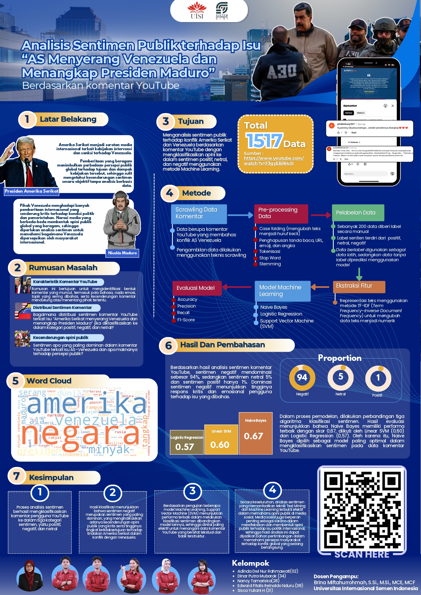

# 🎭 Sentiment Analysis: Geopolitical Issues (Maduro Case)

  
  
<i>Visualisasi Data: Analisis Sentimen Publik terhadap Isu Penangkapan Presiden Maduro</i>

## 📖 Deskripsi Proyek
Folder ini berisi proyek **Natural Language Processing (NLP)** yang berfokus pada analisis reaksi publik internasional. Studi kasus yang diambil adalah isu geopolitik besar mengenai penangkapan Presiden Venezuela, **Nicolas Maduro**, oleh otoritas Amerika Serikat. Proyek ini bertujuan untuk memetakan bagaimana opini masyarakat digital merespons tindakan politik internasional tersebut.

## 🗳️ Project Overview
Proyek ini mengekstraksi dan mengklasifikasikan ribuan opini publik dari YouTube menggunakan pendekatan *Data Mining* untuk memahami pola persepsi masyarakat global terhadap kebijakan hukum Amerika Serikat.

### 📋 Alur Kerja Utama (Workflow)
1. **Data Crawling**: Pengambilan ribuan data komentar secara *real-time* menggunakan **YouTube Data API v3**.
2. **Text Preprocessing**: Pipeline pembersihan teks mendalam menggunakan library **NLTK** dan **Sastrawi**:
   - **Cleansing**: Menghapus noise data (simbol, angka, dan URL).
   - **Case Folding**: Menyeragamkan teks menjadi huruf kecil untuk konsistensi.
   - **Stopword Removal & Stemming**: Menghilangkan kata sambung dan mengubah kata ke bentuk dasar bahasa Indonesia yang baku.
3. **Sentiment Analysis**: Mengimplementasikan algoritma **Naïve Bayes Classifier** untuk menentukan kategori sentimen (Positif, Netral, Negatif).
4. **Insight Extraction**: Transformasi hasil pemodelan menjadi statistik visual yang mudah dipahami.

### 📊 Hasil Analisis (Project Highlights)
* **Topik Utama**: Konflik Geopolitik AS vs Venezuela (Kasus Nicolas Maduro).
* **Volume Data**: Berhasil menganalisis ribuan komentar audiens secara masif.
* **Temuan Kunci**: Analisis menunjukkan hasil yang signifikan di mana **97% audiens memberikan respons NEGATIF**, merefleksikan kritik tajam publik terhadap isu tersebut.

### 🚀 Tech Stack

---
[⬅️ Kembali ke Menu Utama](../README.md)

